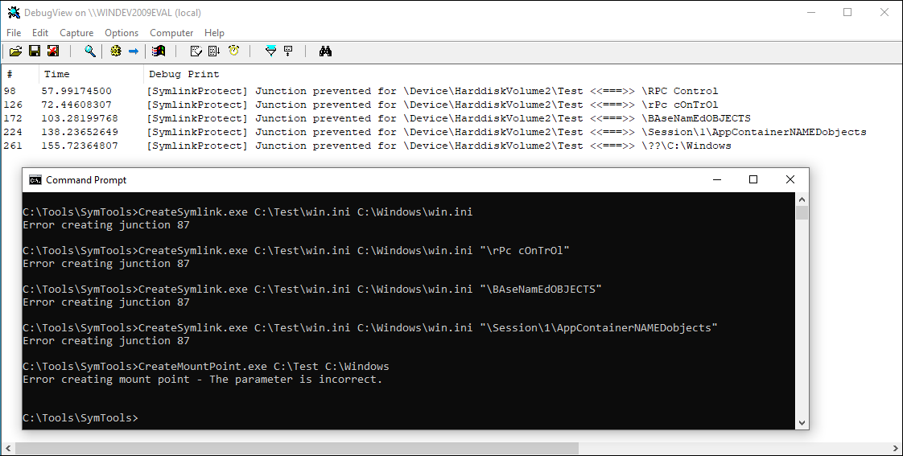

# SymlinkProtect

File system minifilter driver for Windows written in C++ to block symbolic link attacks. It monitors user-mode applications and blocks malicious attempts to set a reparse point on a directory creating a mount point to some suspicious targets like `\RPC Control`. See [here](https://www.seljan.hu/posts/how-to-mitigate-symbolic-link-attacks-on-windows/) for more information about the inner workings of the driver.

## Usage

1. [Download](https://github.com/sgabe/SymlinkProtect/releases) the latest release or compile the driver.
2. Right-click on the *SymlinkProtect.inf* file and click on **Install**.
3. Open an elevated command prompt and enable test signing: \
    `bcdedit /set testsigning on`
4. After reboot, open an elevated command prompt again.
5. Load the driver with `fltmc.exe` with the *load* option: \
    `fltmc load symlinkprotect`
6. Unload the driver with `fltmc.exe` with the *unload* option: \
    `fltmc unload symlinkprotect`

## Demo

